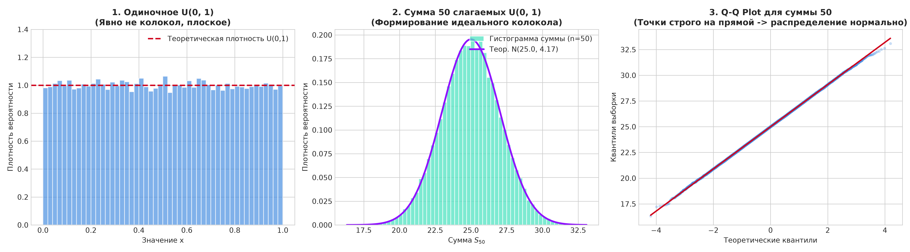
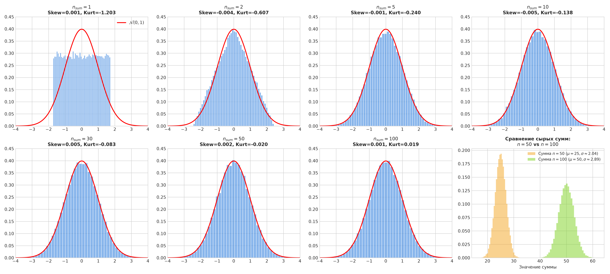
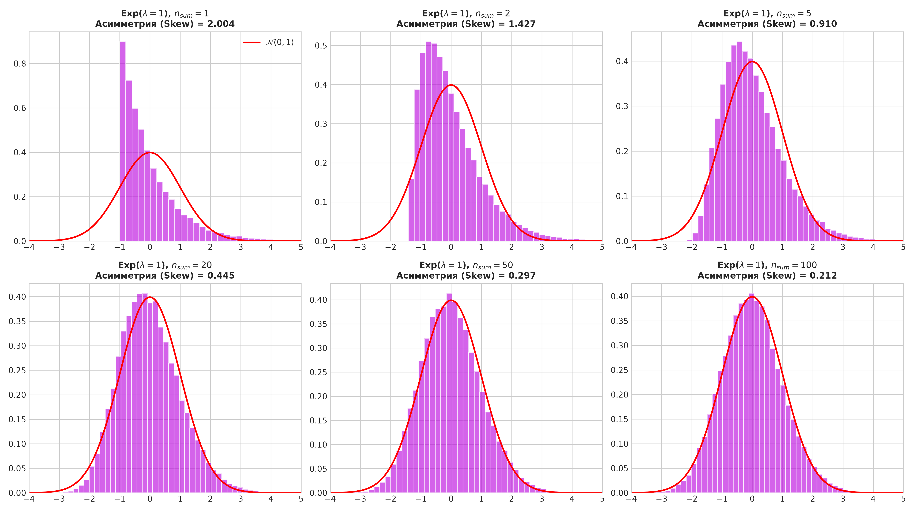
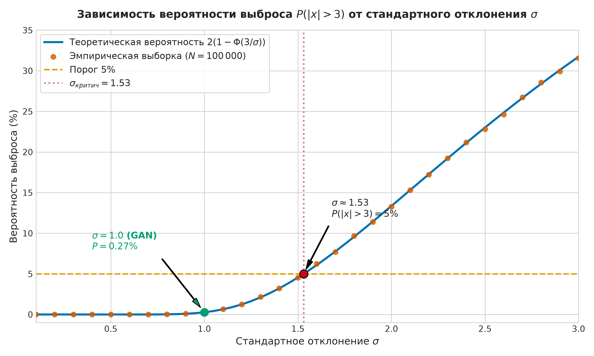
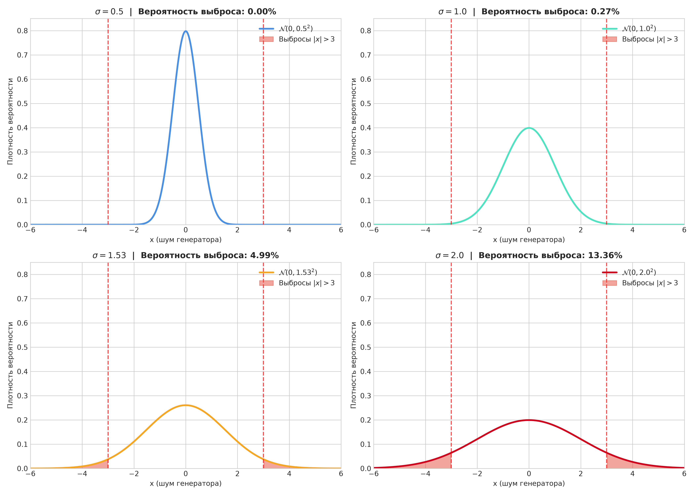

# Лабораторная работа: Нормальное распределение в машинном обучении. От теории к практике.

**Проект:** GAN (`/Users/macpro/PycharmProjects/GAN`)  
**Файлы проекта:**
- [`lab_normal_distribution.py`](file:///Users/macpro/PycharmProjects/GAN/lab_normal_distribution.py) — исполняемый Python-скрипт с полным циклом экспериментов и сохранением графиков.
- [`lab_normal_distribution.ipynb`](file:///Users/macpro/PycharmProjects/GAN/lab_normal_distribution.ipynb) — интерактивный Jupyter Notebook для пошагового запуска и демонстрации.
- Папка с графиками: [`images/`](file:///Users/macpro/PycharmProjects/GAN/images/)

---

## Цель работы
Научиться работать с нормальным распределением как с реальным практическим инструментом анализа данных и машинного обучения (в частности, в генеративных состязательных сетях GAN и диффузионных моделях), а не как с абстрактной математической формулой.

---

# ЗАДАНИЕ 1. ЦЕНТРАЛЬНАЯ ПРЕДЕЛЬНАЯ ТЕОРЕМА (ЦПТ) — ДОКАЗАТЕЛЬСТВО «НА ПАЛЬЦАХ»

### 1. Теоретическая основа
Центральная предельная теорема (ЦПТ) гласит: если $X_1, X_2, \dots, X_n$ — независимые одинаково распределенные случайные величины (i.i.d.) с математическим ожиданием $\mathbb{E}[X_i] = \mu$ и конечной дисперсией $\mathrm{Var}(X_i) = \sigma^2 < \infty$, то распределение их суммы $S_n = \sum_{i=1}^n X_i$ при $n \to \infty$ стремится к нормальному закону:
$$S_n \sim \mathcal{N}\left(n\mu, n\sigma^2\right)$$
Или для стандартизированной суммы:
$$Z_n = \frac{S_n - n\mu}{\sigma \sqrt{n}} \xrightarrow{d} \mathcal{N}(0, 1)$$

Для непрерывного равномерного распределения $X \sim \mathcal{U}(0, 1)$:
- Математическое ожидание: $\mu = \frac{a+b}{2} = 0.5$
- Дисперсия: $\sigma^2 = \frac{(b-a)^2}{12} = \frac{1}{12} \approx 0.08333$
- Для суммы $n = 50$:
  $$\mu_{50} = 50 \times 0.5 = 25.0, \quad \sigma^2_{50} = \frac{50}{12} \approx 4.1667, \quad \sigma_{50} = \sqrt{\frac{50}{12}} \approx 2.0412$$

### 2. Результаты экспериментов
При моделировании выборки размера $N = 50\,000$:
- Эмпирическое среднее: **24.9999** (теоретическое: 25.0000)
- Эмпирическое стандартное отклонение: **2.0508** (теоретическое: 2.0412)
- Асимметрия (Skewness): **-0.00379** (практически 0, идеальная симметрия)
- Эксцесс (Excess Kurtosis): **-0.02636** (практически 0, форма в точности гауссова)

*Рис 1.1: Сравнение исходного плоского распределения $U(0, 1)$, суммы 50 величин с наложенной нормальной кривой и Q-Q plot.*

*Рис 1.2: Прогрессия формы распределения суммы при $n_{sum} \in [1, 2, 5, 10, 30, 50, 100]$ и сравнение масштабов сырых сумм для $n=50$ и $n=100$.*

*Рис 1.3: Проверка ЦПТ для асимметричного экспоненциального распределения $\mathrm{Exp}(\lambda=1)$.*

---

### 3. Ответы на контрольные вопросы (Задание 1)

#### Вопрос 1: Что произойдет с формой гистограммы, если увеличить `n_sum` до 100? Почему?
**Ответ:**
1. **Для сырой суммы $S_n$:**
   - Центр колокола (математическое ожидание) сместится вправо в 2 раза: с $\mu_{50} = 25$ до $\mu_{100} = 100 \times 0.5 = 50$.
   - Ширина колокола (стандартное отклонение) увеличится в $\sqrt{2} \approx 1.414$ раза: с $\sigma_{50} = \sqrt{50/12} \approx 2.041$ до $\sigma_{100} = \sqrt{100/12} \approx 2.887$.
2. **Для стандартизированной суммы $Z_n = \frac{S_n - n\mu}{\sigma\sqrt{n}}$:**
   - Форма колокола станет еще более гладкой и идеальной, вплотную приближаясь к теоретической плотности $\mathcal{N}(0, 1)$.
   - Согласно теореме Берри — Эссеена, верхняя граница ошибки аппроксимации убывает пропорционально $\mathcal{O}(1/\sqrt{n})$, поэтому хвосты распределения при $n=100$ еще точнее соответствуют нормальным.
3. **Для выборочного среднего $\bar{X}_n = \frac{1}{n} S_n$:**
   - Колокол, наоборот, станет значительно уже, концентрируясь вокруг истинного среднего $\mu = 0.5$, так как дисперсия среднего равна $\mathrm{Var}(\bar{X}) = \frac{\sigma^2}{n} = \frac{1}{12n} \to 0$ (Закон больших чисел).

#### Вопрос 2: Что произойдет, если вместо равномерного распределения взять экспоненциальное? Будет ли ЦПТ работать?
**Ответ:**
- **Да, ЦПТ будет работать безупречно!** Центральная предельная теорема применима к абсолютно любому распределению, обладающему конечной дисперсией ($\sigma^2 < \infty$). Для экспоненциального распределения с параметром $\lambda = 1$: $\mu = 1$, $\sigma^2 = 1 < \infty$.
- **Особенность сходимости:** Исходное экспоненциальное распределение является строго асимметричным (коэффициент асимметрии равен $\mathrm{Skewness} = 2$). При малых $n$ ($n = 2, 5$) сумма (распределенная по закону Эрланга / Гамма-распределению) сохраняет правосторонний скос. Однако по мере роста $n$ асимметрия затухает со скоростью $\frac{2}{\sqrt{n}}$:
  - При $n=1$: $\mathrm{Skew} = 2.0$
  - При $n=10$: $\mathrm{Skew} \approx 0.63$
  - При $n=50$: $\mathrm{Skew} \approx 0.28$
  - При $n=100$: $\mathrm{Skew} \approx 0.20$
- Колокол полностью выравнивается и принимает симметричный гауссов вид (см. Рис 1.3).

#### Вопрос 3: Почему на Q-Q plot точки ложатся на прямую линию? Что это означает?
**Ответ:**
- **Q-Q plot (Quantile-Quantile plot)** сопоставляет квантили эмпирической выборки с теоретическими квантилями стандартного нормального распределения.
- Если случайная величина $Y$ распределена нормально $Y \sim \mathcal{N}(\mu, \sigma^2)$, то её квантили связаны с квантилями стандартного нормального распределения $Z \sim \mathcal{N}(0, 1)$ линейным уравнением:
  $$Q_Y(p) = \mu + \sigma \cdot Q_Z(p)$$
- Следовательно, в координатах $(Q_Z, Q_Y)$ график представляет собой прямую линию с угловым коэффициентом $\sigma$ и пересечением $\mu$.
- **Что это означает:** То, что точки выборки суммы $n=50$ ложатся строго на прямую без искривлений на концах, эмпирически доказывает, что распределение суммы является гауссовым не только в центре, но и в хвостах.

#### Вопрос 4: При каком минимальном `n_sum` распределение суммы можно считать нормальным (визуально)?
**Ответ:**
- Для **симметричного равномерного распределения $\mathcal{U}(0, 1)$** колоколообразная форма появляется удивительно быстро — уже при **$n_{sum} \ge 3 - 5$**! (При $n=3$ сумма образует распределение Ирвина — Холла со сглаженными краями, а при $n \ge 10$ гистограмма визуально неотличима от нормальной). В ранних ЭВМ даже использовался алгоритм генерации нормальных величин через сумму 12 равномерных: $Z = \sum_{i=1}^{12} U_i - 6$.
- Для **асимметричных и скошенных распределений** (например, экспоненциального) требуется больше слагаемых: визуальная симметрия и нормальность достигаются при **$n_{sum} \ge 30$**.
- В прикладной статистике универсальным общепринятым эмпирическим правилом считается выборка **$n \ge 30$**.

#### Вопрос 5: Какое практическое значение имеет ЦПТ для машинного обучения? (Подсказка: шум в данных, градиентный спуск, bagging)
**Ответ:**
1. **Шум в данных (Data Noise / Measurement Error):**
   - В реальных сенсорах, изображениях и признаках итоговый шум формируется как суперпозиция множества независимых микро-факторов (температурные флуктуации, квантование, погрешности аналоговых цепей). В силу ЦПТ суммарный шум почти всегда оказывается распределен нормально: $\epsilon \sim \mathcal{N}(0, \sigma_\epsilon^2)$.
   - Это математически обосновывает выбор среднеквадратичной ошибки (MSE) как функции потерь: оптимизация MSE эквивалентна методу максимального правдоподобия (MLE) при предположении аддитивного гауссова шума.
2. **Градиентный спуск (Mini-batch SGD):**
   - Стохастический градиент вычисляется как среднее по мини-батчу: $g_B = \frac{1}{|B|} \sum_{i \in B} \nabla_\theta \mathcal{L}_i(\theta)$.
   - Согласно ЦПТ, при достаточном размере батча ($|B| \ge 32, 64, 128$) распределение градиентного шума приближается к многомерному нормальному: $g_B \sim \mathcal{N}(\nabla \mathcal{L}, \frac{1}{|B|} \Sigma)$. На этом нормальном приближении построены современные оптимизаторы (Adam, RMSProp), теория стохастической динамики Ланжевена (SGLD) и дифференциально-приватное обучение (DP-SGD).
3. **Бэггинг (Bagging — Bootstrap Aggregating, e.g. Random Forest):**
   - Ансамбль усредняет предсказания $M$ базовых некоррелированных моделей: $\hat{f}(x) = \frac{1}{M} \sum_{m=1}^M f_m(x)$.
   - По ЦПТ распределение ошибки ансамбля центрируется и нормализуется, а дисперсия ошибки падает пропорционально числу моделей: $\mathrm{Var}(\hat{f}) \approx \frac{\sigma^2}{M}$, что кардинально снижает переобучение (variance reduction).

---

# ЗАДАНИЕ 2. ИССЛЕДОВАНИЕ ВЛИЯНИЯ ПАРАМЕТРОВ НА ХВОСТЫ РАСПРЕДЕЛЕНИЯ

### 1. Теоретическая основа
В генеративных моделях (GAN, Diffusion Models) латентный вектор шума сэмплируется из стандартного нормального распределения $z \sim \mathcal{N}(0, \sigma^2 I)$.

Вероятность того, что значение координаты шума превысит заданный порог $|x| > 3$, рассчитывается через функцию выживания (survival function) стандартного нормального распределения $\Phi(z)$:
$$P(|X| > 3) = P(X > 3) + P(X < -3) = 2 \cdot \left[1 - \Phi\left(\frac{3}{\sigma}\right)\right] = 2 \cdot \mathrm{sf}\left(\frac{3}{\sigma}\right)$$

### 2. Результаты расчетов и экспериментов
- Для стандартного нормального шума ($\sigma = 1.0$):
  $$P(|x| > 3) = 2 \cdot (1 - \Phi(3)) \approx 0.00270 \quad (0.270\%)$$
  Эмпирический результат ($N = 100\,000$): **0.273%**.
- Для сжатого шума ($\sigma = 0.5$):
  $$P(|x| > 3) = 2 \cdot (1 - \Phi(6)) \approx 1.97 \times 10^{-9} \approx 0.000000\%$$
- Для широкого шума ($\sigma = 2.0$):
  $$P(|x| > 3) = 2 \cdot (1 - \Phi(1.5)) \approx 0.13361 \quad (13.361\%)$$

#### Точный поиск критического значения $\sigma$ для порога 5%:
Условие $P(|X| > 3) > 0.05$:
$$2 \cdot \left(1 - \Phi\left(\frac{3}{\sigma}\right)\right) = 0.05 \implies 1 - \Phi\left(\frac{3}{\sigma}\right) = 0.025 \implies \Phi\left(\frac{3}{\sigma}\right) = 0.975$$
Квантиль стандартного нормального распределения для уровня $0.975$:
$$z_{0.025} = \Phi^{-1}(0.975) \approx 1.959964$$
Отсюда находим точное аналитическое значение:
$$\sigma_{\mathrm{critical}} = \frac{3}{1.959964} \approx \mathbf{1.5306} \approx \mathbf{1.53}$$
При $\sigma > 1.53$ доля выбросов превышает 5% от всей выборки.

*Рис 2.1: Кривая вероятности выброса $P(|x| > 3)$ в зависимости от $\sigma$ с отметками для GAN ($\sigma=1.0$) и критической точки 5% ($\sigma \approx 1.53$).*

*Рис 2.2: Плотности распределения и закрашенные зоны выбросов $|x| > 3$ для $\sigma \in [0.5, 1.0, 1.53, 2.0]$.*

---

### 3. Ответы на контрольные вопросы (Задание 2)

#### Вопрос 1: Как изменяется вероятность выброса при увеличении $\sigma$? Почему?
**Ответ:**
- Вероятность выброса **монотонно и нелинейно возрастает** (по S-образной кривой интеграла ошибок).
- **Причина:** Параметр $\sigma$ является масштабным множителем (scale parameter), определяющим ширину распределения. Фиксированный в пространстве порог $x = 3$ в нормализованных единицах равен $z = \frac{3}{\sigma}$. При росте $\sigma$ относительное расстояние от центра до порога $3/\sigma$ стремительно уменьшается, из-за чего площадь под кривой плотности в областях $(-\infty, -3] \cup [3, +\infty)$ лавинообразно увеличивается от нуля до десятков процентов.

#### Вопрос 2: При каком $\sigma$ вероятность выброса становится больше 5%?
**Ответ:**
- **Аналитическое значение:** $\mathbf{\sigma \approx 1.5306}$ ($\approx \mathbf{1.53}$).
- **Сеточное численное значение:** при $\sigma = 1.55$ вероятность составляет $5.29\%$.
- **Вывод:** Как только стандартное отклонение превышает 1.53, более $5\%$ генерируемых шумовых векторов содержат экстремальные значения, выходящие за диапазон $[-3, 3]$.

#### Вопрос 3: Почему в GAN используют $\sigma = 1$ (стандартное), а не $\sigma = 2$ или $\sigma = 0.5$?
**Ответ:**
- **Если выбрать $\sigma = 2$:** Хвосты становятся чрезмерно «тяжелыми» — более **13.36%** значений уходят в выбросы. Генератор вынужден обрабатывать векторы из областей с исчезающе малой плотностью данных, что приводит к появлению грубых визуальных артефактов (искаженные лица, неестественные текстуры) и нестабильности обучения.
- **Если выбрать $\sigma = 0.5$:** Пространство шума оказывается искусственно сжатым около нуля, а вероятность встретить разнородные паттерны падает практически до нуля ($P(|x|>3) \approx 0$). Это приводит к катастрофической потере вариативности (Mode Collapse) — сеть генерирует однотипные, усредненные изображения.
- **Почему именно $\sigma = 1$:** Это оптимальный математический баланс между плотностью и разнообразием. По правилу трех сигм ровно 99.73% значений сосредоточены в интервале $[-3, 3]$, гарантируя богатое покрытие латентного пространства без засилья деструктивных выбросов.
- **Связь с Truncation Trick (StyleGAN / BigGAN):** На этапе инференса современные генераторы используют трюк усечения: обучают сеть на стандартном $\mathcal{N}(0, 1)$, а при генерации сжимают шум к среднему: $z' = \psi \cdot z$, где $\psi \in [0.7, 1.0]$. Это позволяет гибко регулировать компромисс между фотореалистичностью (высокое качество) и разнообразием картинок.

#### Вопрос 4: Как выбросы в шуме могут влиять на качество генерации в GAN? (Подсказка: что произойдет, если генератор получит очень большое значение на входе?)
**Ответ:**
- Архитектура генератора состоит из линейных/свёрточных слоев и нелинейных функций активации.
- При поступлении экстремального шума ($|x| \gg 3$) взвешенная сумма $z_{next} = Wx + b$ принимает аномально большие по модулю значения.
- **Для насыщающихся активаций (Tanh, Sigmoid):** нейроны мгновенно выходят на горизонтальное плато ($Tanh(u) \to \pm 1$, $Sigmoid(u) \to 0$ или $1$). В этих областях их локальная производная практически равна нулю ($\frac{\partial f}{\partial u} \approx 0$).
- **Для ненасыщающихся активаций (ReLU, LeakyReLU):** происходит взрыв активаций (Activation Explosion), приводящий к численному переполнению в последующих слоях нормализации (BatchNorm / PixelNorm).
- **Визуальный эффект:** Генератор выдает нереалистичные изображения с кислотными цветовыми пятнами, разорванной геометрией («монстры»), геометрическими дырами или шумом.

#### Вопрос 5: Как эта задача связана с проблемой исчезающих градиентов в GAN?
**Ответ:**
1. **Затухание градиентов из-за насыщения нелинейностей генератора:**
   Когда входной вектор содержит выброс, промежуточные и выходные активации генератора насыщаются. При обратном распространении ошибки (Backpropagation) градиент функции потерь умножается на производную активации:
   $$\frac{\partial \mathcal{L}}{\partial W} = \frac{\partial \mathcal{L}}{\partial y} \cdot f'(u) \cdot x$$
   Так как $f'(u) \approx 0$, градиент моментально затухает, и веса сети перестают обновляться.
2. **Переобучение дискриминатора и насыщение Minimax Loss:**
   Артефактное изображение, сгенерированное из-за выброса, дискриминатор моментально распознает как стопроцентный фейк: $D(G(z)) \approx 0$. В классической функции потерь Minimax GAN $\log(1 - D(G(z)))$ в окрестности $D \approx 0$ градиент по отношению к генератору затухает практически до нуля (Vanishing Gradient), лишая генератор обучающего сигнала.
3. **Решение проблемы в современных моделях:**
   Именно для предотвращения затухания градиентов и контроля над хвостами распределений в GAN применяются:
   - Обрезка латентного шума (Latent Truncation);
   - Спектральная нормализация весов (Spectral Normalization);
   - Штраф за градиент (Wasserstein GAN-GP), где функция потерь не насыщается даже при крайних значениях.

---

## Қорытынды (Қазақ тіліндегі түйін)

1. **1-тапсырма (Орталық шектік теорема):**
   - Біркелкі (uniform) немесе экспоненциалды (exponential) үлестірімдердің 50 мәнінің қосындысы Гаусс (нормаль) үлестіріміне өте тез сәйкес келеді.
   - Симметриялы үлестірімдер үшін $n_{sum} \ge 5-10$ болғанда-ақ гистограмма қоңырау тәрізді (колокол) түрге келеді, ал асимметриялы үлестірімдер үшін $n_{sum} \ge 30$ талап етіледі.
   - Q-Q plot сызбасында нүктелердің түзу сызық бойымен орналасуы алынған деректердің толықтай қалыпты (нормаль) заңға бағынатынын көрсетеді.
2. **2-тапсырма (Генеративті модельдер және $\sigma$ параметрлері):**
   - $\sigma = 1.0$ болғанда 3-тен асатын ауытқулар (outliers) небәрі **0.27%** құрайды, бұл GAN моделі үшін латентті кеңістіктің сапасы мен әртүрлілігінің тепе-теңдігін қамтамасыз етеді.
   - Ықтималдығы 5%-дан асатын шектік мән: **$\sigma \approx 1.53$**.
   - Егер $\sigma$ мәні тым үлкен болса ($\sigma \ge 2$), выбростардың көбеюі белсендіру функцияларының (Tanh/Sigmoid) қанығуына (saturation) және градиенттің жоғалуына (vanishing gradient) әкеледі, салдарынан генерация сапасы нашарлайды.
