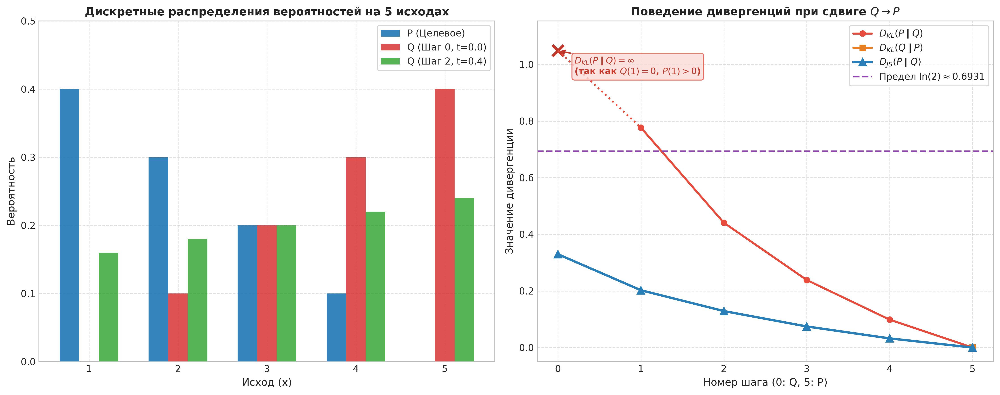
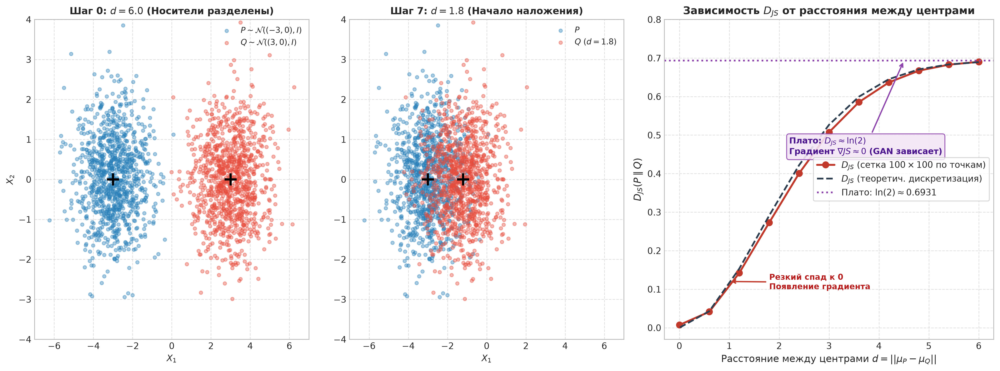
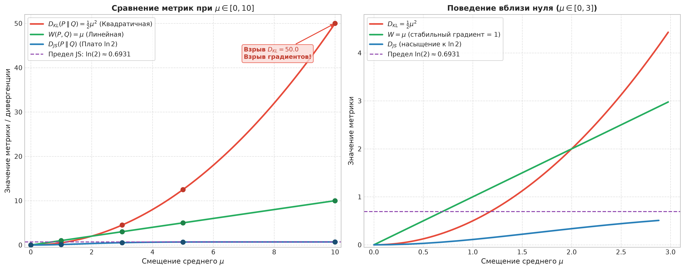

# Лабораторная работа №2: Дивергенции как инструмент отладки GAN

**Проект:** GAN (`/Users/macpro/PycharmProjects/GAN`)  
**Файлы проекта:**
- [`lab2_divergences.py`](file:///Users/macpro/PycharmProjects/GAN/lab2_divergences.py) — исполняемый Python-скрипт с полным циклом экспериментов, табличным выводом и генерацией графиков.
- [`lab2_divergences.ipynb`](file:///Users/macpro/PycharmProjects/GAN/lab2_divergences.ipynb) — интерактивный Jupyter Notebook со всеми формулами, кодом, таблицами и графиками.
- Папка с графиками: [`images/`](file:///Users/macpro/PycharmProjects/GAN/images/)

---

## Цель работы
Математически и практически исследовать поведение метрик расхождения вероятностных распределений (дивергенции Кульбака — Лейблера $D_{KL}$, дивергенции Йенсена — Шеннона $D_{JS}$ и расстояния Вассерштейна $W$), выявить фундаментальные математические причины сбоев и нестабильности обучения классических GAN (исчезновение градиентов, взрыв функций потерь, коллапс мод) и обосновать необходимость перехода к метрике Вассерштейна (WGAN).

---

# ЗАДАЧА 1. KL vs JS: где ломается KL

### 1. Теоретическая основа

#### 1.1. Дивергенция Кульбака — Лейблера ($D_{KL}$)
Для двух дискретных распределений вероятностей $P$ и $Q$ на пространстве исходов $\mathcal{X}$:
$$D_{KL}(P \parallel Q) = \sum_{x \in \mathcal{X}} P(x) \ln \frac{P(x)}{Q(x)}$$
- **Асимметричность:** в общем случае $D_{KL}(P \parallel Q) \neq D_{KL}(Q \parallel P)$.
- **Проблема нулевой вероятности (деление на ноль):**
  - Если $P(x) > 0$, но $Q(x) = 0$, то отношение $\frac{P(x)}{Q(x)} \to +\infty \implies D_{KL}(P \parallel Q) = +\infty$.
  - Для того чтобы $D_{KL}(P \parallel Q) < \infty$, необходимо, чтобы распределение $P$ было абсолютно непрерывно относительно $Q$ ($P \ll Q$), то есть $\mathrm{supp}(P) \subseteq \mathrm{supp}(Q)$.

#### 1.2. Дивергенция Йенсена — Шеннона ($D_{JS}$)
Пусть $M = \frac{1}{2}(P + Q)$ — средняя смесь распределений. Дивергенция Йенсена — Шеннона определяется как:
$$D_{JS}(P \parallel Q) = \frac{1}{2} D_{KL}(P \parallel M) + \frac{1}{2} D_{KL}(Q \parallel M)$$
- **Симметричность:** $D_{JS}(P \parallel Q) = D_{JS}(Q \parallel P)$.
- **Строгая ограниченность:**
  $$0 \le D_{JS}(P \parallel Q) \le \ln(2) \approx 0.69315$$
- **Отсутствие деления на ноль:** если $P(x) > 0$, то $M(x) = \frac{1}{2}(P(x) + Q(x)) \ge \frac{1}{2} P(x) > 0$. Следовательно:
  $$\frac{P(x)}{M(x)} \le \frac{P(x)}{\frac{1}{2}P(x)} = 2 \implies \ln \frac{P(x)}{M(x)} \le \ln 2$$
  Это гарантирует, что $D_{JS}$ всегда конечна, даже если носители $P$ и $Q$ вообще не пересекаются!

---

### 2. Экспериментальные данные и результаты расчетов

Исходные дискретные распределения на 5 исходах:
- $P = [0.4, 0.3, 0.2, 0.1, 0.0]$
- $Q = [0.0, 0.1, 0.2, 0.3, 0.4]$

Плавный сдвиг моделировался линейной интерполяцией $Q_t = (1 - t)Q + tP$ при $t \in [0.0, 1.0]$ за 6 шагов:

| Шаг | Параметр $t$ | Профиль $Q_t(x)$ | $D_{KL}(P \parallel Q)$ | $D_{KL}(Q \parallel P)$ | $D_{JS}(P \parallel Q)$ |
|:---:|:---:|:---|:---:|:---:|:---:|
| **0** | $0.0$ | `[0.00, 0.10, 0.20, 0.30, 0.40]` | **$+\infty$** | **$+\infty$** | **0.3296** |
| **1** | $0.2$ | `[0.08, 0.14, 0.20, 0.26, 0.32]` | **0.7769** | **$+\infty$** | **0.2024** |
| **2** | $0.4$ | `[0.16, 0.18, 0.20, 0.22, 0.24]` | **0.4409** | **$+\infty$** | **0.1289** |
| **3** | $0.6$ | `[0.24, 0.22, 0.20, 0.18, 0.16]` | **0.2386** | **$+\infty$** | **0.0744** |
| **4** | $0.8$ | `[0.32, 0.26, 0.20, 0.14, 0.08]` | **0.0985** | **$+\infty$** | **0.0323** |
| **5** | $1.0$ | `[0.40, 0.30, 0.20, 0.10, 0.00]` | **0.0000** | **0.0000** | **0.0000** |

*Рис. 1: (Слева) Распределения $P$ и $Q$ на шагах интерполяции. (Справа) Поведение дивергенций: $D_{KL}(P \parallel Q)$ уходит в бесконечность на шаге 0 из-за $Q(1)=0$; $D_{KL}(Q \parallel P)$ равен $+\infty$ на шагах 0–4 из-за $P(5)=0$; $D_{JS}$ всегда конечна и не превышает $\ln 2 \approx 0.6931$.*

---

### 3. Ответы на контрольные вопросы («Что понять»)

#### 1. Почему $D_{KL}$ уходит в бесконечность?
- На шаге 0 для первого исхода $x=1$: $P(1) = 0.4 > 0$, в то время как $Q(1) = 0.0$. Член суммы равен $0.4 \cdot \ln(0.4 / 0.0) = +\infty$.
- В обратную сторону: для пятого исхода $x=5$: $Q(5) = 0.4 > 0$, но $P(5) = 0.0$. Поэтому $D_{KL}(Q \parallel P) = +\infty$.
- При интерполяции $Q_t = (1-t)Q + tP$: как только $t > 0$, $Q_t(1) > 0$, поэтому $D_{KL}(P \parallel Q)$ мгновенно становится конечным. Однако для $D_{KL}(Q_t \parallel P)$ пятый исход $P(5) = 0$ остается нулевым вплоть до шага $t = 1.0$, поэтому обратный KL равен бесконечности на всех промежуточных этапах.

#### 2. В какое число упирается JS?
- Максимальное возможное значение дивергенции Йенсена — Шеннона равно **$\ln 2 \approx 0.693147$** (при использовании натурального логарифма) или **$1.0$** (при логарифме по основанию 2).
- Этот предел достигается, когда распределения имеют полностью непересекающиеся носители ($\mathrm{supp}(P) \cap \mathrm{supp}(Q) = \emptyset$). В нашем дискретном примере на шаге 0 носители частично пересекались на исходах $x \in \{2, 3, 4\}$, поэтому $D_{JS} = 0.3296 < \ln 2$.

#### 3. Вывод: почему KL нельзя использовать как функцию потерь в GAN?
- В реальных задачах генератор $G_\theta(z)$ инициализируется случайными весами и генерирует данные, которые с вероятностью 1 не покрывают истинное распределение обучающей выборки $P_{data}$.
- Если попытаться обучать генератор минимизацией прямого KL $D_{KL}(P_{data} \parallel P_g)$, то в любой точке, где реальный объект существует, а генератор выдает нулевую вероятность, градиент $\nabla_\theta D_{KL} \to \infty$, что вызывает мгновенный взрыв градиентов и сбой обучения (`NaN`).
- Если же оптимизировать обратный KL $D_{KL}(P_g \parallel P_{data})$, модель впадает в жесткий **коллапс мод (Mode Collapse)**: генератору выгоднее схлопнуться в одну точку, где $P_{data} > 0$, избегая штрафа $+\infty$, и полностью игнорировать остальные моды данных.

---

# ЗАДАЧА 2. Проблема носителей: почему GAN не учится

### 1. Теоретическая основа и гипотеза многообразий (Manifold Hypothesis)

В оригинальной статье по GAN (Goodfellow et al., 2014) доказано, что если дискриминатор $D$ обучен до оптимума при фиксированном генераторе:
$$D^*(x) = \frac{p_r(x)}{p_r(x) + p_g(x)}$$
то целевая функция генератора строго равна дивергенции Йенсена — Шеннона:
$$\min_G V(D^*, G) = 2 \cdot D_{JS}(P_r \parallel P_g) - 2\ln 2$$
Однако в 2017 году Мартин Аржовский и Леон Ботту доказали теорему о непересекающихся многообразиях:
1. Реальные изображения размерности $D$ (например, $64 \times 64 \times 3 = 12\,288$) на самом деле сосредоточены на подмногообразии существенно меньшей размерности $d \ll D$.
2. Генератор $G_\theta(z)$ преобразует латентный вектор $z \in \mathbb{R}^k$ ($k \ll D$), поэтому сгенерированное распределение $P_g$ также сосредоточено на низкоразмерном многообразии.
3. **Вероятность того, что два случайных низкоразмерных многообразия в пространстве высокой размерности пересекутся, равна нулю.**
4. Когда носители не пересекаются, $D_{JS}(P_r \parallel P_g) = \ln 2 = \mathrm{const}$. Дискриминатор моментально разделяет выборки со 100% точностью, а градиент функции потерь по весам генератора обращается в ноль:
$$\nabla_\theta D_{JS}(P_r \parallel P_\theta) = \mathbf{0}$$
**Генератор не обучается (проблема затухающих градиентов).**

---

### 2. Эксперимент: 2D гауссианы и дискретизация на сетке $100 \times 100$

- Выборка $P$: 1000 точек из $\mathcal{N}((-3, 0), I)$.
- Выборка $Q$: 1000 точек из $\mathcal{N}((3, 0), I)$.
- Пространство дискретизировано на фиксированную сетку $100 \times 100$ узлов в границах $X \in [-7, 7], Y \in [-4, 4]$.
- Центр $Q$ сдвигался к $P$ за 10 интервалов (шаги 0–10, расстояние $d$ от 6.0 до 0.0).

| Шаг | Центр $Q$ | Расстояние $d$ | $D_{JS}$ (сетка по точкам) | $D_{JS}$ (дискретизация плотности) | Состояние носителей |
|:---:|:---:|:---:|:---:|:---:|:---|
| **0** | $(3.00, 0.00)$ | **6.00** | **0.6900** | **0.6893** | Носители полностью разделены ($d \ge 6\sigma$) |
| **1** | $(2.40, 0.00)$ | **5.40** | **0.6828** | **0.6834** | Носители разделены, JS $\approx \ln 2$ |
| **2** | $(1.80, 0.00)$ | **4.80** | **0.6671** | **0.6706** | Плато константы $\ln 2$ |
| **3** | $(1.20, 0.00)$ | **4.20** | **0.6368** | **0.6452** | Начало касания далеких хвостов |
| **4** | $(0.60, 0.00)$ | **3.60** | **0.5857** | **0.5998** | Появление слабого пересечения |
| **5** | $(0.00, 0.00)$ | **3.00** | **0.5075** | **0.5268** | Умеренное наложение |
| **6** | $(-0.60, 0.00)$ | **2.40** | **0.4009** | **0.4221** | Активное пересечение |
| **7** | $(-1.20, 0.00)$ | **1.80** | **0.2728** | **0.2911** | Сильное наложение облаков |
| **8** | $(-1.80, 0.00)$ | **1.20** | **0.1421** | **0.1532** | Быстрый спад JS к нулю |
| **9** | $(-2.40, 0.00)$ | **0.60** | **0.0415** | **0.0431** | Почти полное совпадение |
| **10** | $(-3.00, 0.00)$ | **0.00** | **0.0072** | **0.0000** | Полное совпадение распределений ($P=Q$) |

*Рис. 2: (Панель 1) Шаг 0 ($d=6.0$): облака не пересекаются, JS находится на плато $\ln 2$. (Панель 2) Шаг 7 ($d=1.8$): облака накладываются друг на друга. (Панель 3) Зависимость $D_{JS}$ от расстояния $d$: четко видно горизонтальное плато с нулевой производной при больших расстояниях и крутой спад к нулю при $d \to 0$.*

---

### 3. Ответы на контрольные вопросы («Что понять»)

#### 1. Что происходит при больших расстояниях?
- При $d \ge 5$ точки распределений $P$ и $Q$ попадают в совершенно разные ячейки сетки $100 \times 100$.
- В каждой ячейке $(i, j)$: либо $P_{ij} > 0, Q_{ij} = 0$, либо $Q_{ij} > 0, P_{ij} = 0$.
- В результате $M_{ij} = 0.5 P_{ij}$ (или $0.5 Q_{ij}$), логарифм отношения равен $\ln 2$, и $D_{JS} = \ln 2 \approx 0.6931$.
- **Производная $\frac{\partial D_{JS}}{\partial d} = 0$. Градиент равен нулю!**

#### 2. Когда появляется градиент?
- Градиент появляется только тогда, когда облака точек начинают существенно накладываться друг на друга (при $d \le 3.5$, то есть в пределах $2\sigma$–$3\sigma$).
- В этой зоне значение $D_{JS}$ резко падает от $0.69$ до $0.0$, обеспечивая направленный вектор градиента в сторону сближения.

#### 3. Главный вывод: почему в высоких размерностях классический GAN зависает?
- В двумерном пространстве (2D) пересечение гауссианов еще возможно заметить на дистанциях в несколько сигм.
- Но в пространствах размерности $D = 1000$ или $D = 10\,000$ объем пространства растет экспоненциально («проклятие размерности»). Вероятность того, что сгенерированное облако случайно заденет носитель реальных данных, практически равна нулю ($e^{-D}$).
- Дискриминатор мгновенно становится идеальным ($D(x)=1$ для реальных, $D(x)=0$ для фейковых), градиенты затухают до машинного нуля, и генератор перестает обучаться.
- **Вывод:** для успешного обучения необходима метрика, которая измеряет «геометрическую работу по переносу массы» и имеет ненулевой градиент даже при совершенно изолированных носителях. Такой метрикой является **расстояние Вассерштейна (Earth Mover's Distance)**.

---

# ЗАДАЧА 3. Wasserstein vs KL vs JS: сравнение на одном графике

### 1. Математический вывод формул для гауссианов

Рассматриваются одномерные гауссианы $P \sim \mathcal{N}(0, 1)$ и $Q \sim \mathcal{N}(\mu, 1)$, где $\mu \in [0, 10]$.

#### 1.1. Аналитический расчет $D_{KL}(P \parallel Q)$
Формула KL-дивергенции для двух нормальных распределений $\mathcal{N}(\mu_1, \sigma_1^2)$ и $\mathcal{N}(\mu_2, \sigma_2^2)$:
$$D_{KL}(P \parallel Q) = \ln \frac{\sigma_2}{\sigma_1} + \frac{\sigma_1^2 + (\mu_1 - \mu_2)^2}{2\sigma_2^2} - \frac{1}{2}$$
Подставляя $\mu_1 = 0, \sigma_1 = 1$, $\mu_2 = \mu, \sigma_2 = 1$:
$$D_{KL}(P \parallel Q) = \ln 1 + \frac{1 + (0 - \mu)^2}{2 \cdot 1} - \frac{1}{2} = \frac{\mu^2}{2}$$
- **Характер роста:** строго квадратичный ($\propto \mu^2$).
- **Градиент:** $\frac{\partial D_{KL}}{\partial \mu} = \mu$. При росте $\mu$ градиент растет неограниченно (взрыв градиентов).

#### 1.2. Численный расчет $D_{JS}(P \parallel Q)$
Для непрерывных плотностей $p(x)$ и $q(x)$:
$$D_{JS}(P \parallel Q) = \frac{1}{2} \int_{-\infty}^{\infty} p(x) \ln \frac{2p(x)}{p(x)+q(x)} dx + \frac{1}{2} \int_{-\infty}^{\infty} q(x) \ln \frac{2q(x)}{p(x)+q(x)} dx$$
- Вычисляется методом адаптивной численной квадратуры Гаусса — Кронрода (`scipy.integrate.quad`).
- **Характер роста:** при $\mu \to \infty$ интегралы сходятся к $\frac{1}{2} \ln 2 + \frac{1}{2} \ln 2 = \ln 2 \approx 0.69315$.
- **Градиент:** при $\mu \ge 4$ производная $\frac{\partial D_{JS}}{\partial \mu} \to 0$ (затухание градиента).

#### 1.3. Расчет расстояния Вассерштейна $W_2(P, Q)$
Для двух одномерных гауссианов 2-расстояние Вассерштейна выражается формулой:
$$W_2(P, Q) = \sqrt{(\mu_1 - \mu_2)^2 + (\sigma_1 - \sigma_2)^2}$$
Так как $\sigma_1 = \sigma_2 = 1$, второй член равен нулю:
$$W(P, Q) = \sqrt{(0 - \mu)^2 + (1 - 1)^2} = \sqrt{\mu^2} = \mu$$
- **Характер роста:** строго линейный ($\propto \mu$).
- **Градиент:** $\frac{\partial W}{\partial \mu} = 1 = \mathrm{const}$ для всех $\mu > 0$!

---

### 2. Результаты расчетов и сравнительная таблица

Таблица контрольных точек при $\mu \in \{0, 1, 3, 5, 10\}$:

| $\mu$ | $D_{KL}(P \parallel Q) = \frac{\mu^2}{2}$ | $D_{JS}(P \parallel Q)$ (численно) | $W(P, Q) = \mu$ | Анализ градиента для оптимизации |
|:---:|:---:|:---:|:---:|:---|
| **0.0** | **0.0000** | **0.0000** | **0.0000** | Идеальное совпадение ($P=Q$), минимум всех функций |
| **1.0** | **0.5000** | **0.1114** | **1.0000** | Умеренные градиенты во всех метриках |
| **3.0** | **4.5000** | **0.5268** | **3.0000** | JS замедляет рост; KL ускоряется |
| **5.0** | **12.5000** | **0.6759** | **5.0000** | JS вошел в плато ($\approx 0.693$); KL взлетает до 12.5 |
| **10.0** | **50.0000** | **0.6931** | **10.0000** | **JS насытился (градиент = 0); KL взорвался (50); W стабилен (градиент = 1)** |

*Рис. 3: (Слева) Полный масштаб $\mu \in [0, 10]$: квадратичный взрыв KL до 50.0, насыщение JS на асимптоте $\ln 2 \approx 0.6931$ и идеальная линейная прямая Вассерштейна $W=\mu$. (Справа) Детальный масштаб вблизи нуля $\mu \in [0, 3]$.*

---

### 3. Ответы на контрольные вопросы («Что понять»)

| Метрика | Поведение кривой при $\mu \to \infty$ | Поведение градиента | Последствия для обучения генератора |
|:---|:---|:---|:---|
| **$D_{KL}$** | **Квадратичный рост** ($\frac{\mu^2}{2}$) | Неограниченно растет ($\nabla = \mu \to \infty$) | **Взрыв градиентов:** нестабильность весов, шаги оптимизатора улетают в бесконечность |
| **$D_{JS}$** | **Выход на плато** ($\ln 2 \approx 0.693$) | Экспоненциально затухает к нулю ($\nabla \to 0$) | **Исчезающий градиент:** генератор не знает, куда сдвигать распределение, обучение останавливается |
| **$W$** | **Линейный рост** ($\mu$) | **Строго постоянен** ($\nabla = 1 = \mathrm{const}$) | **Идеальный обучающий сигнал:** стабильный градиент одинаковой силы на любых расстояниях |

#### Итоговый вывод:
**Расстояние Вассерштейна — единственная метрика среди рассмотренных, пригодная для надежного обучения генератора при произвольном начальном расстоянии между распределениями.**

Благодаря двойственности Канторовича — Рубинштейна:
$$W_1(P_r, P_g) = \sup_{\|f\|_L \le 1} \mathbb{E}_{x \sim P_r}[f(x)] - \mathbb{E}_{x \sim P_g}[f(x)]$$
нейронная сеть-критик $f_w(x)$, ограниченная условием 1-Липшицевости (через клиппинг весов в WGAN или штраф на норму градиента в WGAN-GP), формирует абсолютно непрерывное силовое поле градиентов, которое плавно и стабильно притягивает сгенерированные объекты к истинным данным, навсегда решая проблему «зависания» GAN.
