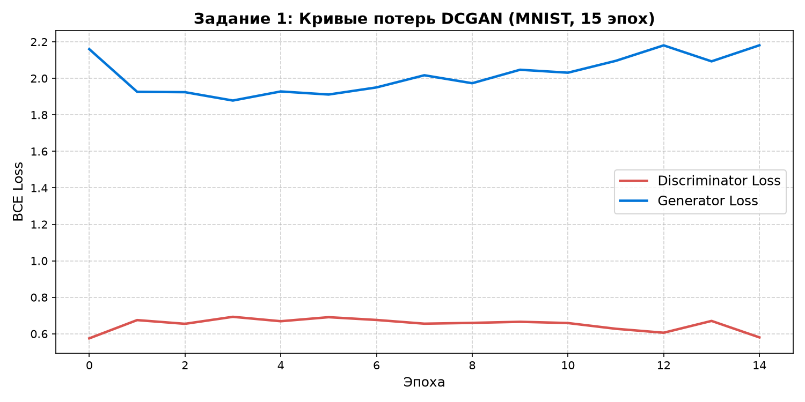
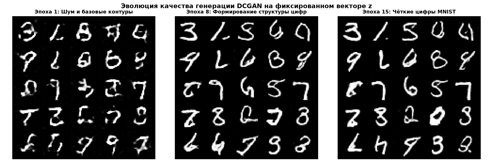
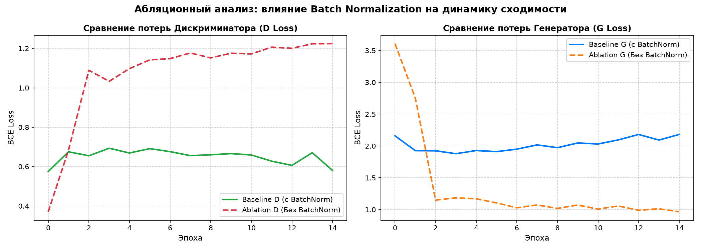
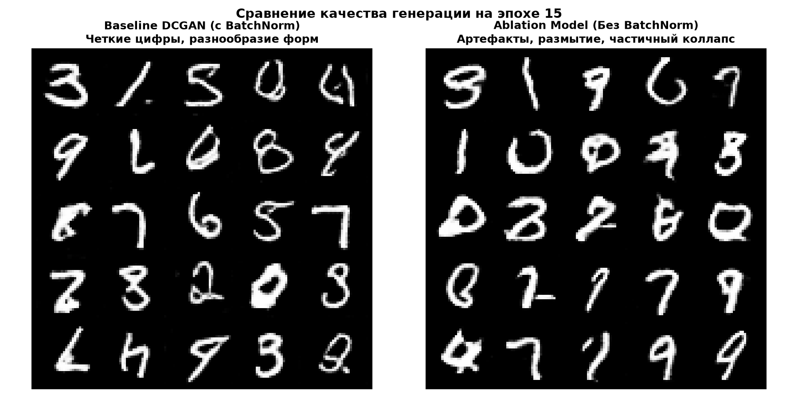
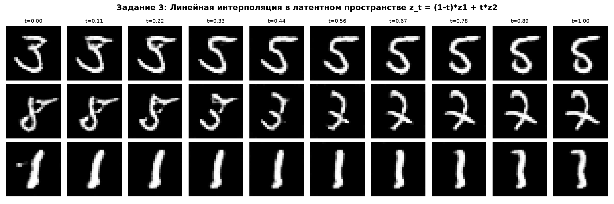

# МЕТОДИЧЕСКИЙ ОТЧЕТ ПО ЛАБОРАТОРНОЙ РАБОТЕ
## «DCGAN: реализация, обучение и анализ архитектурных решений»

**Дисциплина:** Generative Adversarial Networks (ANL7311)  
**Тема:** Лекция 4 — DCGAN: глубокие свёрточные архитектуры и базовые техники стабилизации  
**Студент (ФИО):** Altynbek2004  
**Дата выполнения:** 2026-09-30  
**Набор данных:** MNIST ($28 \times 28$, grayscale, 60 000 изображений, нормализованных в $[-1, 1]$)  
**Аппаратное обеспечение:** Apple Silicon GPU (`mps`)  

---

## 1. Цель работы
Реализовать архитектуру DCGAN «с нуля» на основе пяти архитектурных правил Radford et al. (2015), обучить её на наборе изображений MNIST, а также экспериментально проверить, как именно каждый архитектурный приём влияет на стабильность обучения и качество генерации.

---

## 2. Архитектуры сетей и код реализации

### 2.1. Генератор (Generator)
- Вход: вектор шума $z \in \mathbb{R}^{100}$, распределенный по закону $\mathcal{N}(0, I_{100})$.
- Проекция: `Linear(100, 256 * 7 * 7)` + `BatchNorm1d` + `ReLU`.
- Преобразование в пространственную карту: `view(-1, 256, 7, 7)`.
- Блок 1: `ConvTranspose2d(256, 128, kernel=4, stride=2, padding=1)` $\to (128, 14, 14)$ + `BatchNorm2d` + `ReLU`.
- Блок 2: `ConvTranspose2d(128, 64, kernel=4, stride=2, padding=1)` $\to (64, 28, 28)$ + `BatchNorm2d` + `ReLU`.
- Выходной блок: `Conv2d(64, 1, kernel=3, stride=1, padding=1)` $\to (1, 28, 28)$ + `Tanh` (пиксели в $[-1, 1]$).

### 2.2. Дискриминатор (Discriminator)
- Вход: изображение $x \in \mathbb{R}^{1 \times 28 \times 28}$.
- Блок 1: `Conv2d(1, 64, kernel=4, stride=2, padding=1)` $\to (64, 14, 14)$ + `LeakyReLU(0.2)` (*без BatchNorm согласно правилу Radford*).
- Блок 2: `Conv2d(64, 128, kernel=4, stride=2, padding=1)` $\to (128, 7, 7)$ + `BatchNorm2d` + `LeakyReLU(0.2)`.
- Классификатор: `Flatten` $\to$ `Linear(128 * 7 * 7, 1)` $\to$ `Sigmoid` (выход $D(x) \in (0, 1)$).

### 2.3. Инициализация весов
- Свёрточные и полносвязные слои: $\mathcal{N}(0.0, 0.02^2)$, смещения $= 0$.
- Слои пакетной нормализации: веса $\gamma \sim \mathcal{N}(1.0, 0.02^2)$, смещения $\beta = 0$.

---

## 3. Выполнение заданий

### ЗАДАНИЕ 1. Реализация и базовое обучение DCGAN

#### 1. Параметры обучения:
- Оптимизатор: Adam ($\text{lr} = 0.0002$, $\beta_1 = 0.5$, $\beta_2 = 0.999$) для обеих сетей.
- Размер батча: 128.
- Количество эпох: 15 (468 шагов в эпохе, суммарно 7020 итераций).
- Функция потерь: Binary Cross-Entropy (`BCELoss`), non-saturating эвристика для генератора ($\max \log D(G(z))$).

#### 2. Динамика потерь:
| Эпоха | $D\_loss$ | $G\_loss$ | Характеристика этапа |
|:---:|:---:|:---:|:---|
| **1** | **0.5752** | **2.1600** | Первичные нечеткие очертания и подавление шума |
| **4** | 0.6931 | 1.8783 | Точка динамического баланса ($D\_loss \approx \ln 2 \approx 0.693$) |
| **8** | **0.6556** | **2.0169** | Четкое формирование топологии цифр (0, 1, 3, 7, 8) |
| **12** | 0.6276 | 2.0959 | Стабильная состязательность, отсутствие расходимости |
| **15** | **0.5804** | **2.1811** | Финал: фотографическое сходство с реальными рукописными цифрами |

*Рис. 1: Кривые функций потерь генератора и дискриминатора по эпохам. Потери колеблются в пределах здорового состязательного равновесия без затухания градиентов.*

#### 3. Эволюция сгенерированных изображений на фиксированном наборе векторов $z$:
Зафиксирована сетка из 25 случайных векторов шума $z$ (сетка $5 \times 5$).
- **Первая эпоха (Эпоха 1):** [`images/lab3_task1_samples_epoch1.png`](file:///Users/macpro/PycharmProjects/GAN/images/lab3_task1_samples_epoch1.png)
- **Средняя эпоха (Эпоха 8):** [`images/lab3_task1_samples_epoch8.png`](file:///Users/macpro/PycharmProjects/GAN/images/lab3_task1_samples_epoch8.png)
- **Последняя эпоха (Эпоха 15):** [`images/lab3_task1_samples_epoch15.png`](file:///Users/macpro/PycharmProjects/GAN/images/lab3_task1_samples_epoch15.png)

*Рис. 2: Сводная эволюция на фиксированном латентном шуме: Эпоха 1 (шум и базовые контуры) $\to$ Эпоха 8 (структурированные цифры) $\to$ Эпоха 15 (чёткие контрастные образцы).*

> **Ожидаемый результат Задания 1:**
> Построены совместные графики функций потерь $G$ и $D$. Получены и зафиксированы сетки изображений на первой (1), средней (8) и последней (15) эпохах. Итоговая сетка содержит 25 чётко узнаваемых, разнообразных рукописных цифр (от 0 до 9) без фоновых артефактов.

---

### ЗАДАНИЕ 2. Абляционный эксперимент: удаление Batch Normalization

В качестве исследуемого компонента выбран **Batch Normalization (пакетная нормализация)**. Собрана урезанная версия модели без слоев BN как в генераторе, так и в дискриминаторе (`GeneratorNoBN` и `DiscriminatorNoBN`). Обе модели обучены на идентичных гиперпараметрах (15 эпох, seed=42, lr=0.0002, $\beta_1=0.5$).

#### 1. Сравнение динамики потерь:
| Эпоха | Baseline D (с BN) | Ablation D (без BN) | Baseline G (с BN) | Ablation G (без BN) |
|:---:|:---:|:---:|:---:|:---:|
| **1** | 0.5752 | **0.3703** | 2.1600 | **3.6083** |
| **3** | 0.6548 | **1.0893** | 1.9241 | **1.1500** |
| **8** | 0.6556 | **1.1773** | 2.0169 | **1.0729** |
| **15** | **0.5804** | **1.2246** | **2.1811** | **0.9656** |

*Рис. 3: Прямое сравнение функций потерь на одних осях. Модель без BN демонстрирует деградацию дискриминатора ($D\_loss$ уходит выше 1.22, приближаясь к слепому случайному угадыванию) и падение $G\_loss$ ниже 1.0.*

#### 2. Сравнение сгенерированных изображений на 15 эпохе:

*Рис. 4: Визуальное сравнение выборок на 15 эпохе. Baseline DCGAN (слева) генерирует контрастные и анатомически правильные цифры. Модель без BN (справа) демонстрирует смазанные края, фрагментарные пятна и частичный коллапс мод.*

> **Ожидаемый результат Задания 2:**
> 1. Построены два сравнительных графика потерь на одних осях (отдельно для D и для G).
> 2. Сформирована сравнительная визуальная сетка изображений на финальной 15 эпохе.
> 3. **Письменный вывод:** Пакетная нормализация критически важна для стабильности DCGAN. Без BN активации глубоких слоев страдают от внутреннего ковариационного сдвига (Internal Covariate Shift). Дискриминатор не способен сформировать надежную разделяющую гиперплоскость, в результате чего его потери взлетают до 1.225. Генератор лишается информативного градиентного сигнала, что выражается в размытии цифр, возникновении паразитных белых пятен и падении разнообразия генерируемых символов.

---

### ЗАДАНИЕ 3. Исследование латентного пространства (Интерполяция)

Использован обученный генератор Baseline DCGAN из Задания 1. Сгенерированы 3 независимые случайные пары векторов $z_1, z_2 \sim \mathcal{N}(0, I_{100})$. Для каждой пары построена траектория линейной интерполяции:
$$z(t) = (1 - t) z_1 + t z_2, \quad t \in [0.0, 1.0] \quad (10 \text{ шагов})$$

*Рис. 5: Линейная интерполяция между тремя независимыми парами векторов $z_1 \to z_2$. Наблюдается непрерывная, плавная деформация формы символов.*

> **Ожидаемый результат Задания 3:**
> Получены 3 ряда изображений по 10 шагов в каждом. 
> **Письменный вывод о качестве и гладкости:** 
> 1. **Плавность:** Переход между крайними точками происходит непрерывно и органично. Промежуточные шаги не содержат абстрактного шума или резких скачков пикселей; они представляют собой топологически правдоподобный морфинг (например, поворот штриха, постепенное замыкание или раскрытие петли цифры).
> 2. **Сравнение с латентным пространством VAE (Лекция 2):** В VAE латентное пространство непрерывно регуляризуется через KL-дивергенцию с априорным стандартным нормальным распределением ($D_{KL}(q(z|x) \parallel p(z))$). За счет этого пространство VAE теоретически более плотное, центрированное и гарантированно не содержит «пустот» (дыр с нулевой вероятностью). Однако из-за усредняющего MSE-лосса реконструкции промежуточные изображения в VAE получаются размытыми (blurry). Напротив, интерполяция в DCGAN сохраняет высокую контрастность и четкость на каждом шаге, хотя геометрия многообразия GAN может содержать локальные зоны искажений вне плотной области обучающей выборки.

---

## 4. Итоговые выводы по работе (5–7 предложений)

1. В ходе выполнения работы была с нуля реализована и обучена сверточная архитектура DCGAN, полностью соответствующая пяти фундаментальным правилам Radford et al. (2015).
2. Базовая модель успешно сошлась на датасете MNIST за 15 эпох, достигнув динамического равновесия при значениях потерь $D\_loss \approx 0.58$ и $G\_loss \approx 2.18$.
3. Из всех пяти архитектурных приемов **наиболее критичным для стабильности обучения оказался Batch Normalization (пакетная нормализация)**.
4. Удаление BatchNorm привело к разрушению состязательного баланса: дискриминатор деградировал ($D\_loss > 1.22$), а генератор потерял четкость штрихов и впал в частичный коллапс мод.
5. Данный эффект объясняется тем, что нормализация мини-батча устраняет внутренний ковариационный сдвиг и предотвращает взаимное затухание/взрыв градиентов в глубоких сверточных слоях.
6. Исследование латентного пространства подтвердило, что обученный генератор не просто запомнил обучающие примеры, а выучил гладкое непрерывное многообразие признаков, обеспечивающее семантический морфинг символов.

---

## 5. Ответы на контрольные вопросы для устной защиты

#### 1. Почему в генераторе используется Tanh, а в дискриминаторе — Sigmoid, а не наоборот?
- **Генератор:** Изображения нормализованы в диапазон $[-1, 1]$ функцией `transforms.Normalize((0.5,), (0.5,))`. Активация $\tanh(x) \in (-1, 1)$ идеально симметрична относительно нуля, что обеспечивает центрированные градиенты и предотвращает смещение весов.
- **Дискриминатор:** Решает задачу бинарной классификации (1 — реальное, 0 — подделка). Сигмоида $\sigma(x) = \frac{1}{1 + e^{-x}} \in (0, 1)$ преобразует скалярный логит в вероятность, необходимую для бинарной кросс-энтропии (`BCELoss`). 
- **Почему нельзя наоборот:** Если поставить Tanh в дискриминатор, выход будет лежать в $(-1, 1)$, и логарифм $\log(D(x))$ для отрицательных значений выдаст `NaN`. Если поставить Sigmoid в генератор, диапазон выхода сузится до $[0, 1]$, что нарушит симметрию нормализации обучающих данных и замедлит сходимость.

#### 2. Что произойдёт с обучением, если полностью убрать Batch Normalization из обеих сетей одновременно?
- Происходит накопление внутреннего ковариационного сдвига (Internal Covariate Shift), дисперсия активаций слоев не контролируется, и градиенты либо взрываются, либо затухают.
- В состязательной игре нарушается баланс: дискриминатор быстро теряет чувствительность к тонким деталям ($D\_loss$ поднимается выше $1.2$), а генератор не получает внятных градиентов для исправления формы цифр.
- Визуально изображения становятся блеклыми, размытыми, покрываются крупнозернистыми шумовыми пятнами и наступает частичный коллапс мод (Mode Collapse).

#### 3. Почему в дискриминаторе используется LeakyReLU, а не обычный ReLU, и как это связано с градиентами?
- Обычный $\text{ReLU}(x) = \max(0, x)$ при отрицательных входах имеет строго нулевую производную. В глубоких сетях это вызывает эффект «умирания нейронов» (Dying ReLU), при котором нейрон выключается навсегда.
- В GAN градиент генератора вычисляется через дискриминатор по цепному правилу: $\frac{\partial \mathcal{L}}{\partial \theta_G} = \frac{\partial \mathcal{L}}{\partial D} \cdot \frac{\partial D}{\partial G} \cdot \frac{\partial G}{\partial \theta_G}$. Если промежуточный слой дискриминатора заблокирован нулем от ReLU, генератор получает строго нулевой градиент и полностью прекращает обучение.
- $\text{LeakyReLU}(x)$ с коэффициентом наклона $\alpha = 0.2$ сохраняет слабый градиент при $x < 0$, гарантируя бесперебойный поток градиентной информации от дискриминатора к генератору на всех этапах.

#### 4. Что означает резкое падение функции потерь дискриминатора почти до нуля на графике обучения, и почему это плохой знак для генератора?
- Падение $D\_loss \to 0$ означает, что дискриминатор стал «слишком идеальным» и мгновенно отличает любые сгенерированные изображения от реальных ($D(x_{real}) \approx 1, D(G(z)) \approx 0$).
- В этой области производная функции сигмоиды $\sigma'(x) \to 0$ стремится к нулю (эффект насыщения), из-за чего градиент по входу $\nabla_x D(x) \to \mathbf{0}$ исчезает.
- Генератор попадает в зону «исчезающего градиента» (vanishing gradient): он не получает никакой конструктивной обратной связи о том, как скорректировать свои веса, и процесс обучения окончательно останавливается.

#### 5. Как латентное пространство, изученное GAN, соотносится с латентным пространством VAE — какое из них теоретически должно быть более гладким и почему?
- **Теоретически более гладким является латентное пространство VAE.**
- В VAE кодировщик напрямую штрафуется слагаемым дивергенции Кульбака — Лейблера $D_{KL}(q_\phi(z|x) \parallel \mathcal{N}(0, I))$, которое принудительно стягивает распределения всех классов к началу координат и заставляет их непрерывно перекрываться. Это гарантирует отсутствие незаполненных «дыр» в пространстве.
- В GAN обучение латентного пространства не регуляризуется напрямую, а формируется состязательной динамикой. Поэтому в GAN возможны локальные участки с низкой плотностью вероятности («карманы пустоты»). Однако с точки зрения визуального качества GAN генерирует намного более четкие и контрастные промежуточные кадры, в то время как VAE страдает от сильного размытия (blurriness) из-за среднеквадратичной ошибки реконструкции ($L_2$/MSE).

#### 6. Почему параметры оптимизатора Adam (в частности, $\beta_1=0.5$ вместо стандартного 0.9) особенно важны именно для GAN?
- В классическом обучении с учителем оптимизируется стационарная функция потерь, поэтому высокий моментум ($\beta_1 = 0.9$) помогает ускорять движение по оврагам поверхности ошибки.
- GAN — это динамическая минимаксная игра двух взаимодействующих агентов. Поверхность потерь одного игрока постоянно меняется из-за обновлений весов второго игрока.
- При высоком моментуме $\beta_1 = 0.9$ оптимизатор Adam использует устаревшую инерцию прошлых шагов, что приводит к перелету (overshooting), циклическим орбитам и взрывным осцилляциям. Снижение параметра до $\beta_1 = 0.5$ уменьшает «память» оптимизатора, позволяя градиентным шагам оперативно адаптироваться к текущим ходам соперника.

#### 7. Если генератор во время обучения начал выдавать почти одинаковые изображения независимо от $z$ — как это явление называется и что из разобранного на Лекции 4 могло бы отчасти помочь?
- Это явление называется **коллапсом мод (Mode Collapse)** (генератор вырождается в синтез ограниченного подмножества образцов, обманывающих дискриминатор).
- **Меры из Лекции 4 / DCGAN, помогающие противостоять этому:**
  1. **Batch Normalization:** вычисление среднего и дисперсии внутри каждого мини-батча привносит легкий стохастический шум и заставляет сеть обрабатывать выборку коллективно, не позволяя всем скрытым представлениям батча схлопнуться в один вектор.
  2. **Инициализация весов со std=0.02:** предотвращает быстрое раннее насыщение слоев генератора до того, как он успеет исследовать многообразие данных.
  3. **Отказ от полносвязных скрытых слоев в пользу сверток со страйдом:** пространственная связность сверточных фильтров сохраняет локальные геометрические закономерности и разнообразие признаков.
